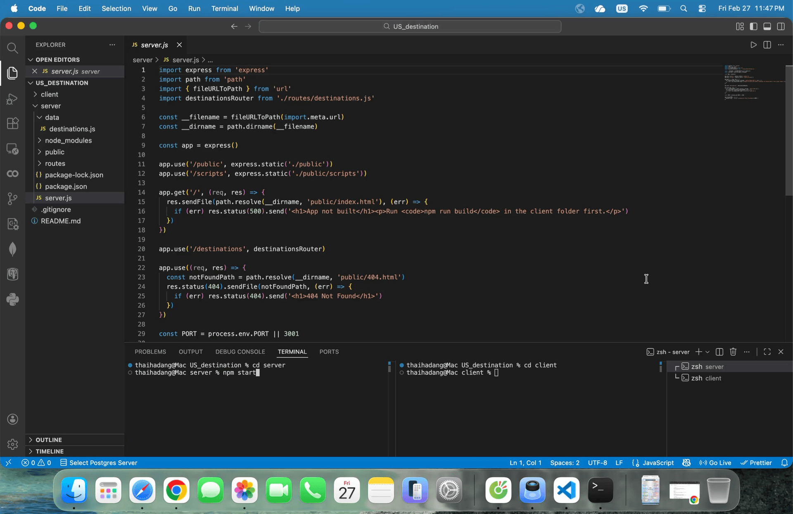

# WEB103 Project 1 - _Discover US_

Submitted by: **ThaiHa Dang**

About this web app: **App description here**

Time spent: **5** hours

## Required Features

The following **required** functionality is completed:

<!-- Make sure to check off completed functionality below -->

- [x] **The web app uses only HTML, CSS, and JavaScript without a frontend framework**
- [x] **The web app displays a title**
- [x] **The web app displays at least five unique list items, each with at least three displayed attributes (such as title, text, and image)**
- [ X] **The user can click on each item in the list to see a detailed view of it, including all database fields**
  - [X ] **Each detail view should be a unique endpoint, such as as `localhost:3001/destinations` and `localhost:3001 `**
  - [ X] _Note: When showing this feature in the video walkthrough, please show the unique URL for each detailed view. We will not be able to give points if we cannot see the implementation_
- [x] **The web app serves an appropriate 404 page when no matching route is defined**
- [x] **The web app is styled using Picocss**

The following **optional** features are implemented:

- [x] The web app displays items in a unique format, such as cards rather than lists or animated list items

The following **additional** features are implemented:

- [x] List anything else that you added to improve the site's functionality!

## Video Walkthrough

\*\*Note: please be sure to

Here's a walkthrough of implemented required features:



<!-- Replace this with whatever GIF tool you used! -->

GIF created with ... Add GIF tool here

<!-- Recommended tools:
[Kap](https://getkap.co/) for macOS
[ScreenToGif](https://www.screentogif.com/) for Windows
[peek](https://github.com/phw/peek) for Linux. -->

## Notes

Describe any challenges encountered while building the app or any additional context you'd like to add.

## License

Licensed under the Apache License, Version 2.0 (the "License"); you may not use this file except in compliance with the License. You may obtain a copy of the License at

> http://www.apache.org/licenses/LICENSE-2.0

Unless required by applicable law or agreed to in writing, software distributed under the License is distributed on an "AS IS" BASIS, WITHOUT WARRANTIES OR CONDITIONS OF ANY KIND, either express or implied. See the License for the specific language governing permissions and limitations under the License.

# Discover US

Tourist destinations in the US. Express backend serves static HTML/CSS/JS and a JSON API.

## Structure

- **Client** (Vite, vanilla HTML/CSS/JS): static frontend
- **Server** (Express): static file serving + JSON API at `/destinations`

## Setup

1. **Client**

   ```bash
   cd client && npm install
   ```

2. **Server**

   ```bash
   cd server && npm install
   ```

3. **Logo**  
   Add `client/public/logo.png` for the header. A placeholder is shown if the file is missing.

## Run

1. **Start the API server**

   ```bash
   cd server && npm start
   ```

   Root: http://localhost:3001 → “Discover US API”  
   API: http://localhost:3001/destinations

2. **Build and run the client**
   ```bash
   cd client && npm run build && npm run dev
   ```
   App: http://localhost:5173 (Vite proxies `/destinations` to the server.)

## Features

- Home page with header and list of US destinations (name, state, category, image)
- Click “Read More” for a detail page (all fields)
- 404 page for unknown routes
